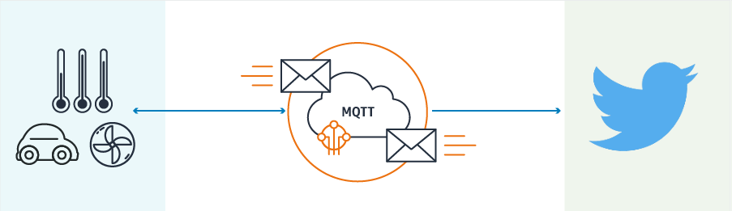

# iot-button-lab

This service provides a bridge between AWS IoT and Twitter for your devices to tweet messages directly to Twitter. Adapted from https://github.com/TensorIoT/sar-iot-twitter-bridge 

# Lab Steps
- [ ] [Register a thing](https://docs.aws.amazon.com/iot/latest/developerguide/configure-iot.html)
- [ ] [Create an iOT Policy](https://docs.aws.amazon.com/iot/latest/developerguide/create-iot-policy.html)
- [ ] [Attach the policy](https://docs.aws.amazon.com/iot/latest/developerguide/attach-policy-to-certificate.html)
- [ ] [Let there be wifi!](https://docs.aws.amazon.com/iot/latest/developerguide/configure-iot.html)
- [ ] Launch the iot-twitter-bridge from the Lambda Serverless Application Repository.
- [ ] replace the contents of index.py in Lambda with the file in this repository
- [ ] set you team name
